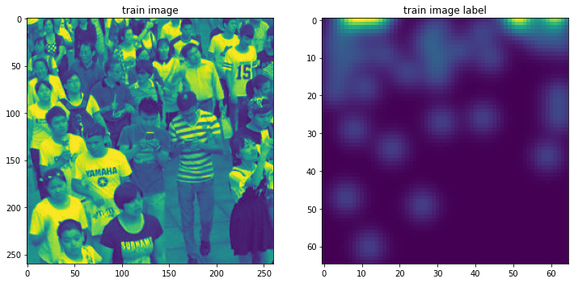
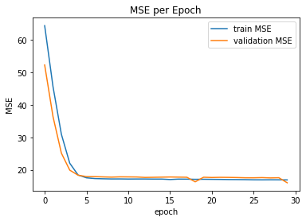
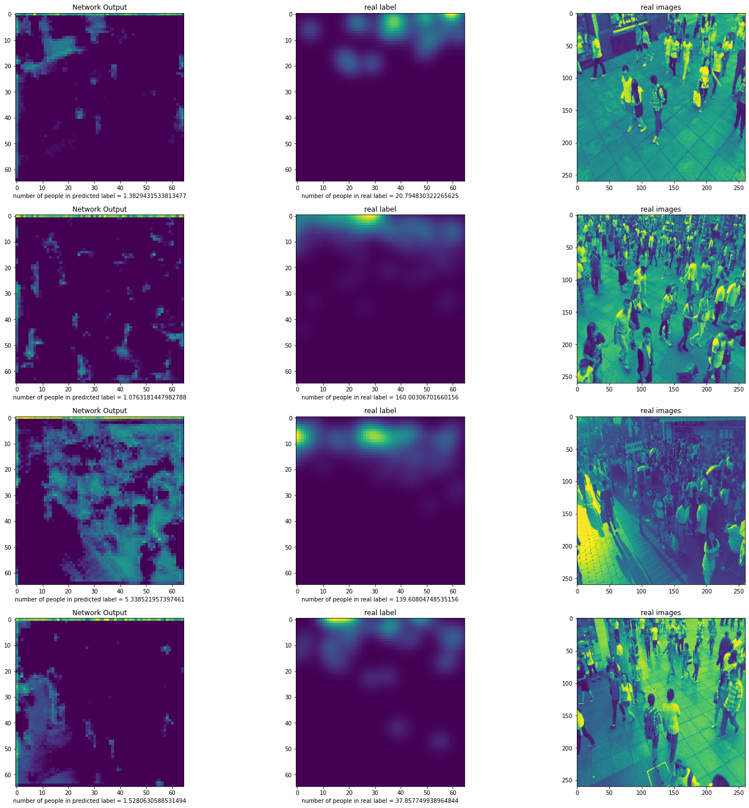

# Crowed Counting with Deep Learning
Crowd counting or crowd estimating is a technique used to count or estimate the number of people in a crowd [(Wikipedia)](https://en.wikipedia.org/wiki/Crowd_counting).
Nowadays with help of Deep Learning, we can do this task with neural networks from an image. In this project I implemented model of paper entitled "Towards Perspective-Free Object Counting with Deep Learning" by Daniel O˜noro-Rubio et al.

## Preprocess:
after resizing and rescaling the coordinates of each point in the image and applyin a gussain filter in each coordination, the data is ready for training a neural network.
below is a sample of training data:

## Training
- I use ADAM Optimizer for training network and power 2 of norm1 distatnce as loss function.
- Due to the small amount of data, augmentation methods have also been used to increase the data.
The process of changing the value of the Loss function is available below

## Results
Below is the result of traning proposed network with data augmentation

