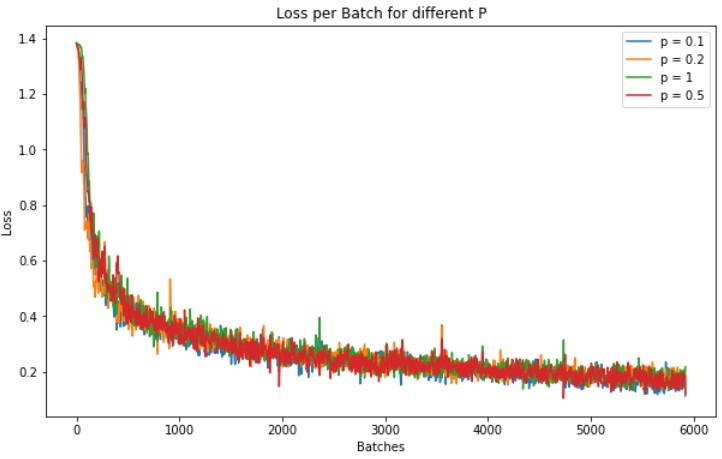
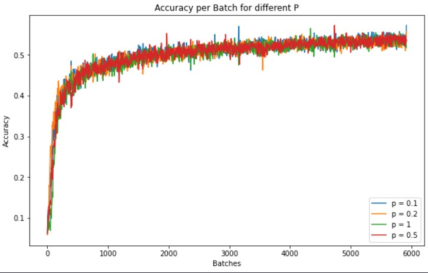

# Distributed Gossip training for Fashion MNIST classification
This Project is a Pytorch Implementation of a paper entitled "Gossip training for deep learning" by Michael Blot et al which proposed a distributed method for training deep learning networks.

I've used the Gossip training method for a multilabel classification task

## Dataset
For implementing gossip training I chose [fashion MNIST](https://github.com/zalandoresearch/fashion-mnist) for training and evaluation of networks. Images of this dataset are gray-level images in 10 classes as described below:  
`0: T-shirt/top, 1: Trouser, 2: Pullover, 3: Dress, 4: Coat, 5: Sandal, 6: Shirt, 7: Sneaker, 8: Bag, 9: Ankle boot`  

As a preprocessing step, before Training the networks I normalized the images.  

## Training
I've implemented different Configurations of Gossip training to investigate the role of probability parameters, Communication matrix, and the kind of communication graph.  
different models are listed below:  
- centralized model
- Gossip training
  - Gossip training for different values of parameter `p` as the probability of communication
  - Gossip training for different communication matrices
    -  Random Matrix
    -  Double Random Matix
    - The matrix variates with time
  - Gossip training for Different Communication graphs
    -  strongly connected
    -  periodically strongly connected

Below you can see loss and accuracy during training for different amounts of parameter `p`:

- Loss during training  
  

  
- Accuracy during training  
  

  

## Results
Results for different values of parameter `p` are in the below table

| Parameter `p` | Accuracy% |
| --- | ----------- |
| 1 | 87,14 |
| 0.5 | 87,29 |
| 0.2 | 87,25 |
| 0.1 | 86,45 |

Results for different Communication matrices are as below

| communication matrix | Accuracy% |
| --- | ----------- |
| Random | 90,98 |
| Double Random | 90,56 |
| Varying with time | 86,94 |

Results for different Communication graphs are as below

| communication graph | Accuracy% |
| --- | ----------- |
| Periodically strongly connected | 89,18 |
| Strongly connected | 89,81 |

