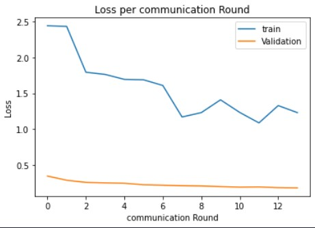
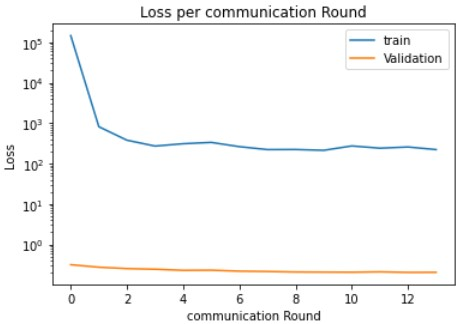
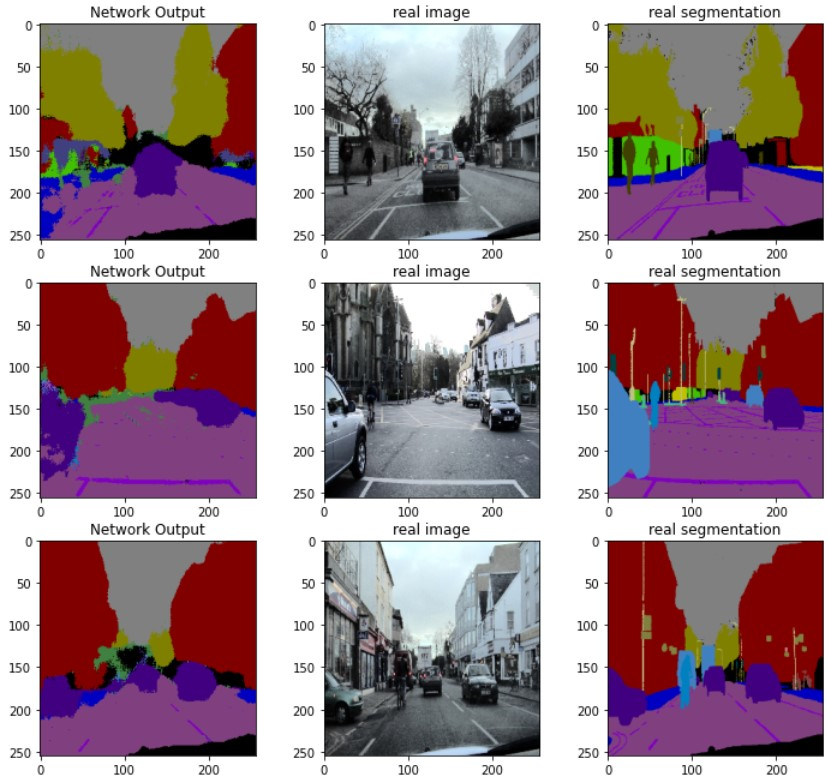

# Federated Learning on Semantic Segmentation task (FedAVG, FedADMM)
Federated Learning is one of the new eras of Deep Learning whose aim is to train a global Network with respect to private local networks. Leaning on smartphones and medical tasks are some of the important applications of Federated learning.

In this Project, I've used federated learning for Image segmentation of Autonomous Driving cars data. We can consider a network of each car as a private and local network and we want to train a global network to be robust against perturbations.
This project is a Pytorch Implementation of two papers 
- "FEDERATED OPTIMIZATION IN HETEROGENEOUS NETWORKS" by  Tian Li et al introduces the FedADMM algorithm for aggregation of weights of local networks
- "Communication-Efficient Learning of Deep Networks from Decentralized Data" by H. Brendan McMahan et al introduces Federate learning for the first time and uses the average aggregation method.

## Data
I've divided Camvid Dataset which is a famous dataset for segmentation, for each local network and local networks datasets are Non-IID.  

## Model
For the segmentation task, I've used SegNet. we have multiple local SegNet Networks for each Autonomous car and a Global Network for Aggregating weights of local networks. All of the Networks have the same Architecture.

Below Loss function of Both Aggregation methods are shown:  
  
- Loss function of Average Aggregation during communication rounds for 3 local networks and one global network  
  

  
- Loss function of ADMM Aggregation (FedADMM) during communication rounds for 2 local networks and one global network  
  

## Results
  
Some of the segmented images with the fedADMM aggregation are in blew figure, we can see that this method works as well as [centralized training of segnet](https://github.com/amirhosein-mesbah/Deep_Learning/tree/main/Image_Segmentation_SegNet)  
   

