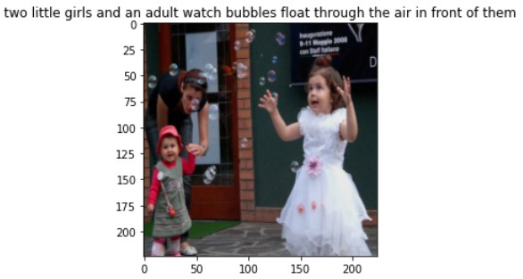
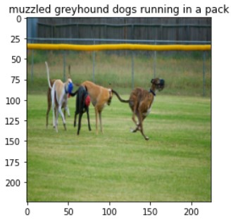
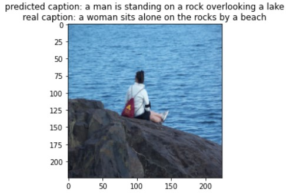
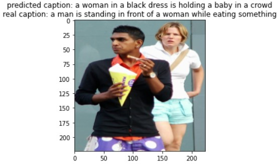
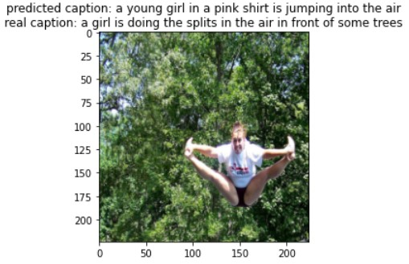

# Image Captioning

Image Captioning is one of the most fantastic applications of Deep Learning which uses multi-modal data (image and text) to generate captions for each given image. In This project, I use PyTorch to implement an image captioning task using ResNet Network architecture for creating embeddings for images and LSTMs for generating captions for each image.
This project is an implementation of paper entitled "image captioning" by Vikram Mullachery et al.

## DataSet
In this project I've used 'flickr8k' dataset for training and evaluation of the network.

## PreProcessing
multiple methods applied on dataset to preprocess the dataset are:
- Resizeing and Normalization of images
- Creating Dictioanry with respect to captions of each image
two training data samples are shown below

## Training
I consider three different architectures and conditions for training:
- freezed ResNet (except last layer) for generating image embeddings (transfer learning and fine tuning) and LSTM for Caption generation
- Unfreezed Resnet and LSTM for Caption generation
- Bi-LSTM for Caption generation

loss function of these three configurations are shown below

## Results
some results for the second configuration (Unfreezed ResNet) are shown below

