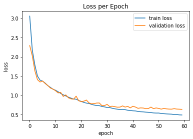
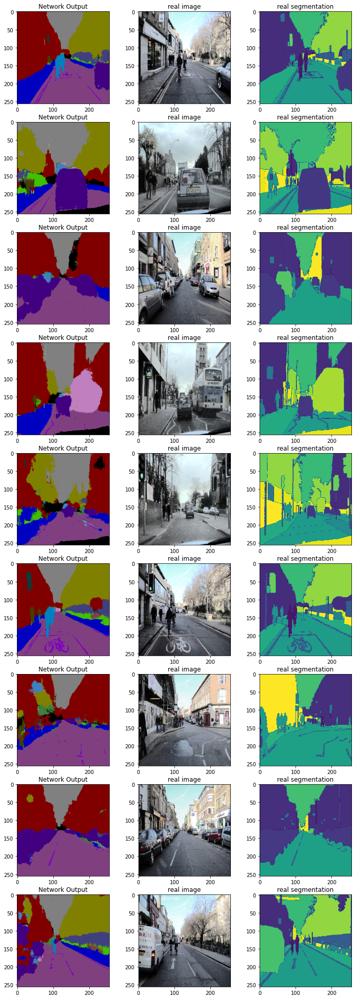

# Semantic segmentation with Segnet

Semantic Segmentation is one of the classic tasks of Computer vision and deep learning. in this project I've implemented SegNet. the Network which was introduced in the paper entitled "SegNet: A Deep Convolutional Encoder-Decoder Architecture for Image Segmentation" by Vijay Badrinarayanan et al.
I've used Pytorch framework for this implementation.

## PreProcessing
multiple preprocessing that has been done on images to be ready for training are:
- resizing images
- creating codecs (labels) for each pixels
- one hot encoding for label of pixels

## Training
after deviding data to 3 sets of train, validation and test, the SegNet Network is trained with proposed data for 2 cases (network with batch normalization and network without bach normalization. Amount of loss function during trainig is shown below

## Results
results for segmentation of test images for the network without batch normalization is shown below

