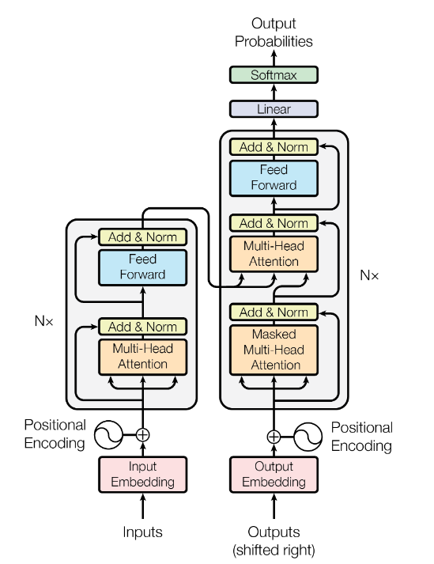

# Machine translation with transformers (Persian to English)
Machine Translation using Deep Learning is one of the popular tasks in NLP. With the introduction of Transformers by Google this kind of tasks entered a new era.
This project is a Pytorch Implementation of "Attention is all you need" Paper by Ashish Vaswani et al. The Encoder Module is implemented from Scratch and the Decoder module is the decoder of pytorch.
  

  
## Dataset
In this project I use the dataset of [Computational Audio-Vision Lab](https://visionlab.ut.ac.ir/) for training model.

## PreProcession
Several preprocessing is applied to clean data and make it ready for training like:
- creating dictionary 
- removing infrequent tokens 
- adding tokens like <SOS>, <EOF>, <PAD>
- handleing persian unicodes

and also I use two different methods for tokenization:
- tokenizing with NLTK and regex
- Byte Pair Encoding
  
## Training
I've used a model with 3 layers of encoder and 3 layers of decoder to train a translator! and also i need to mention that we have 3 kinds of models:

- model with NLTK Tokenizer without with layer normalization
- model with Byte Pair Encoding withiut with layer normalization
- model with layer normalization and NLTK tokenizer
  
## Results
after 8 hours training the results of the mean NIST and mean Blue Score for first (best) model is given in the table below:

| Mean corpus Blue score      | Mean corpus NIST score  |
| ----------- | ----------- |
| 14,63%      | 1,95        |

Also some translation examples (from English to Persian) is shown in the below table:

| English      | Persian (translation of model)  |
| ----------- | ----------- |
| hello , do we drive together to Hanover on the twenty-eighth of March ?     | سلام . ما در مارس با یکدیگر به هانوور حرکت خواهیم کرد ?        |
| it is more comfortable by train .    | قطار راحت تر است        |
| a good idea . then we will meet at the airport tomorrow .    | پس فردا همدیگر را در فرودگاه ملاقات خواهیم کرد       |
| what is planned for the evening ?     | برنامه ریزی برای عصر چیست ?        |
| in any case a cheap hotel .     | در هر صورت ارزان قیمت در هر صورت ارزان .        |
| I prefer the plane .     | من هواپیما را ترجیح میدهم .        |
  
  
  
  
  

