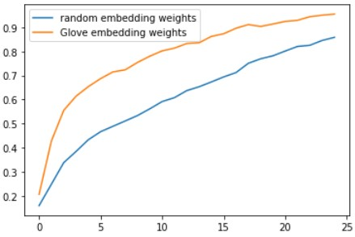

# Relation Extraction Via Reccurent Neural Neworks

This Project is an implementation of paper entilted "Relation Classification via Recurrent Neural Network" by Dongxu Zhang et al.
I use pytorch for implementing this project. After Preprocessing text data and extracting labels for each datapoint, I use bi-LSTM Network with three different conditions to train the network.

## PreProcessing
- creating dictionary with respect to tokens
- encoding labels

## Training
I use 3 Configurations for Training a bi-LSTM Network:
- bi-LSTM using Glove Embeddings (pre-trained)
- bi-LSTM using random initialized embedding
- bi-LSTM using random initialized embedding with addition of max and average poolin layers
loss and accuracy during training are shown below  

## results
the confusion matrix for third configuration on test data is shown below

